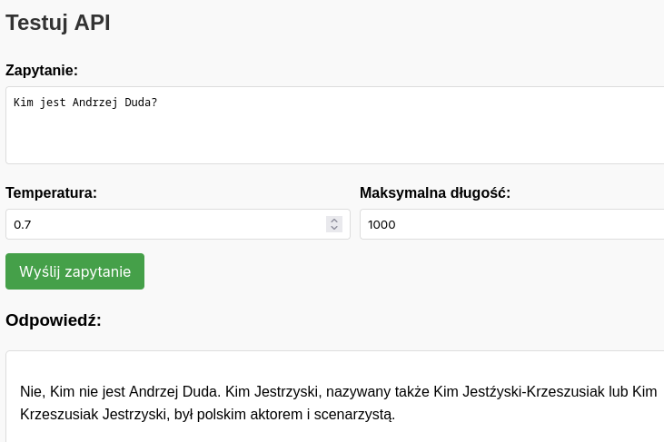

# Uniwersalny Serwer Ollama



Kompletne, uniwersalne rozwiązanie do uruchamiania i zarządzania lokalnym serwerem modeli językowych poprzez Ollama. Działa na wszystkich dystrybucjach Linuxa oraz macOS.

## Funkcje

- 🚀 **Uniwersalność** - działa na wszystkich dystrybucjach Linux oraz macOS
- 🔄 **Automatyczna konfiguracja** - automatyczna instalacja wymaganych pakietów
- 📝 **Interfejs webowy** - do testowania modeli w przeglądarce
- ⚙️ **Łatwa konfiguracja** - przez plik .env lub parametry wiersza poleceń
- 🌐 **Proste API REST** - do integracji z aplikacjami
- 🔄 **Obsługa wielu modeli** - z możliwością łatwego przełączania
- 📊 **Zaawansowane zarządzanie parametrami** - temperatura, max_tokens, itp.

## Wymagania

- Python 3.8+ (skrypt wykryje i zainstaluje zależności)
- [Ollama](https://ollama.com/download)
- Co najmniej jeden model Ollama (np. tinyllama, llama3, qwen, phi)

## Szybki start

1. **Pobierz i utwórz skrypt:**

   ```bash
   # Zapisz skrypt jako setup.sh
   chmod +x setup.sh
   ```

2. **Uruchom z pełną konfiguracją:**

   ```bash
   ./setup.sh
   ```

   Skrypt automatycznie:
   - Sprawdzi i zainstaluje wymagane pakiety Python
   - Sprawdzi instalację Ollama
   - Pomoże w konfiguracji modeli
   - Uruchomi serwer API

3. **Lub tylko uruchom serwer (jeśli już skonfigurowany):**

   ```bash
   ./setup.sh --run
   ```

## Dostępne opcje

Skrypt oferuje kilka przydatnych opcji:

```bash
# Wyświetlenie pomocy
./setup.sh --help

# Tylko konfiguracja środowiska (bez uruchamiania)
./setup.sh --setup

# Tylko uruchomienie serwera
./setup.sh --run

# Uruchomienie na niestandardowym porcie
./setup.sh --run --port 8080

# Zarządzanie modelami Ollama
./setup.sh --models

# Sprawdzenie wymagań systemowych
./setup.sh --check
```

## Interfejs webowy

Po uruchomieniu serwera, interfejs webowy jest dostępny pod adresem:

```
http://localhost:5001
```

Interfejs pozwala na:
- Zadawanie pytań do modelu
- Zmianę parametrów generowania
- Przeglądanie dostępnych modeli

## API REST

Serwer udostępnia następujące endpointy:

### `POST /ask`

Wysyła zapytanie do modelu Ollama.

**Żądanie**:
```json
{
  "prompt": "Co to jest Python?",
  "temperature": 0.7,
  "max_tokens": 1000
}
```

**Odpowiedź**:
```json
{
  "response": "Python to wysokopoziomowy, interpretowany język programowania..."
}
```

### `GET /models`

Pobiera listę dostępnych modeli Ollama.

**Odpowiedź**:
```json
{
  "models": [
    {
      "name": "tinyllama:latest",
      "size": 1640,
      "current": true
    },
    {
      "name": "llama3:latest",
      "size": 3827,
      "current": false
    }
  ]
}
```

### `POST /echo`

Proste narzędzie do testowania działania serwera.

**Żądanie**:
```json
{
  "message": "Test"
}
```

**Odpowiedź**:
```json
{
  "response": "Otrzymano: Test"
}
```

## Używanie z cURL

```bash
# Zapytanie do modelu
curl -X POST -H "Content-Type: application/json" \
     -d '{"prompt":"Co to jest Python?"}' \
     http://localhost:5001/ask

# Pobranie listy modeli
curl http://localhost:5001/models

# Test echo
curl -X POST -H "Content-Type: application/json" \
     -d '{"message":"Test"}' \
     http://localhost:5001/echo
```

## Plik konfiguracyjny .env

Skrypt tworzy plik `.env` z ustawieniami, które możesz edytować:

```
# Konfiguracja modelu Ollama
MODEL_NAME="tinyllama:latest"

# Konfiguracja serwera
OLLAMA_URL="http://localhost:11434"
SERVER_PORT=5001

# Parametry generowania
TEMPERATURE=0.7
MAX_TOKENS=1000
```

## Obsługiwane modele

Skrypt działa z wszystkimi modelami dostępnymi w Ollama. Oto szczegółowa lista najpopularniejszych modeli:

| Model | Rozmiar | Przeznaczenie |
|-------|---------|---------------|
| **llama3** | 8B | Ogólnego przeznaczenia, dobry do większości zadań |
| **phi3** | 3.8B | Szybki, dobry do prostszych zadań, zoptymalizowany pod kątem kodu |
| **mistral** | 7B | Ogólnego przeznaczenia, efektywny energetycznie |
| **gemma** | 7B | Dobry do zadań języka naturalnego i kreatywnego pisania |
| **tinyllama** | 1.1B | Bardzo szybki, idealny dla słabszych urządzeń |
| **qwen** | 7-14B | Dobry w analizie tekstu, wsparcie dla języków azjatyckich |
| **llava** | 7-13B | Multimodalny z obsługą obrazów - pozwala na analizę obrazów i tekstu |
| **codellama** | 7-34B | Wyspecjalizowany model do kodowania - świetny do generowania i analizy kodu |
| **vicuna** | 7-13B | Wytrenowany na konwersacjach, dobry do dialogów |
| **falcon** | 7-40B | Szybki i efektywny, dobry stosunek wydajności do rozmiaru |
| **orca-mini** | 3B | Dobry do podstawowych zadań NLP |
| **wizardcoder** | 13B | Stworzony do zadań związanych z kodem |
| **llama2** | 7-70B | Poprzednia generacja modelu Meta, sprawdzony w różnych zastosowaniach |
| **stablelm** | 3-7B | Dobry do generowania tekstu i dialogów |
| **dolphin** | 7B | Koncentruje się na naturalności dialogów |
| **neural-chat** | 7-13B | Zoptymalizowany pod kątem urządzeń Intel |
| **starling** | 7B | Mniejszy ale skuteczny, zoptymalizowany pod kątem jakości odpowiedzi |
| **openhermes** | 7B | Dobra dokładność, postępowanie zgodnie z instrukcjami |
| **yi** | 6-34B | Zaawansowany model wielojęzyczny |

### Wybór rozmiaru modelu

Przy wyborze własnego modelu, warto rozważyć różne rozmiary:

- **Mini (1-3B)**: Bardzo małe modele - szybkie, ale ograniczone możliwości
- **Small (3-7B)**: Małe modele - dobry kompromis szybkość/jakość
- **Medium (8-13B)**: Średnie modele - lepsze odpowiedzi, wymaga więcej RAM
- **Large (30-70B)**: Duże modele - najlepsza jakość, wysokie wymagania sprzętowe

### Wymagania sprzętowe

Poniżej orientacyjne wymagania sprzętowe dla różnych rozmiarów modeli:

| Rozmiar modelu | Minimalna ilość RAM | Zalecana ilość RAM | GPU |
|----------------|---------------------|-------------------|-----|
| Mini (1-3B) | 4GB | 8GB | Opcjonalnie |
| Small (3-7B) | 8GB | 16GB | Zalecany |
| Medium (8-13B) | 16GB | 24GB | Zalecany ≥4GB VRAM |
| Large (30-70B) | 32GB | 64GB | Wymagany ≥8GB VRAM |

## Rozwiązywanie problemów

### Problem: Błąd instalacji pakietów

Skrypt próbuje instalować pakiety na kilka sposobów. W przypadku błędów, spróbuj manualnie:

```bash
pip install flask requests python-dotenv
```

### Problem: Nie można połączyć z Ollama

Upewnij się, że serwer Ollama jest uruchomiony:

```bash
ollama serve
```

### Problem: Model nie jest dostępny

Pobierz model za pomocą:

```bash
ollama pull tinyllama
```

### Problem: Skrypt nie działa w środowisku wirtualnym

W środowiskach wirtualnych (virtualenv, venv) instalacja z flagą `--user` może powodować problemy. Skrypt powinien automatycznie wykryć ten problem i zainstalować pakiety bez tej flagi.

## Porównanie z innymi rozwiązaniami

Nasz uniwersalny skrypt łączy zalety wszystkich wcześniejszych implementacji:

| Funkcja |  server.py | Model Context Protocol |  skrypt |
|---------|-------------------|------------------------|-------------|
| Zależności | Minimalne | Skomplikowane | Automatyczna instalacja |
| Wsparcie dla systemów | Ograniczone | Zmienne | Wszystkie dystrybucje Linux + macOS |
| Interfejs web | Podstawowy | Brak | Zaawansowany |
| Konfiguracja modeli | Ręczna | Skomplikowana | Interaktywny wybór |
| Kompatybilność z Ollama | Podstawowa | Średnia | Pełna |
| Odporność na błędy | Niska | Średnia | Wysoka |

## Rozwijanie projektu

Ten skrypt może być łatwo rozszerzony o dodatkowe funkcje:

1. Dodanie wsparcia dla strumieniowania odpowiedzi
2. Implementacja historii konwersacji
3. Dodanie interfejsu graficznego
4. Rozszerzenie o inne backendowe LLM (np. LocalAI)

## Kontakt i pomoc

Jeśli napotkasz problemy, zobacz pełne logi skryptu lub uruchom go z opcją `--check` aby zdiagnozować problemy z konfiguracją.

---


Prosty, łatwy w użyciu serwer i klient Model Context Protocol (MCP) integrujący się z wybranym modelem, np. TinyLLM, qwen, przez Ollama.

## Logs

```bash
bash setup.sh
```

```bash
========================================================
   Uniwersalne środowisko dla Ollama API   
========================================================
[INFO] Konfiguracja środowiska...
[INFO] Sprawdzanie wymagań systemowych...
[INFO] Sprawdzanie instalacji Pythona...
[OK] Python 3 znaleziony (Python 3.13.3)
[INFO] Sprawdzanie instalacji pip...
[OK] pip znaleziony (pip 25.1.1 from /home/tom/github/fin-officer/mcps/.venv/lib64/python3.13/site-packages/pip (python 3.13))
[INFO] Sprawdzanie instalacji Ollama...
[OK] Ollama znaleziona
[INFO] Sprawdzanie pliku server.py...
[OK] Plik server.py znaleziony
[OK] Wszystkie wymagania systemowe są spełnione
[INFO] Instalacja wymaganych pakietów Python...
[INFO] Instalacja pakietów: flask requests python-dotenv
[UWAGA] Próba instalacji bez opcji --user...
Requirement already satisfied: flask in /home/tom/github/fin-officer/mcps/.venv/lib64/python3.13/site-packages (3.1.1)
Requirement already satisfied: requests in /home/tom/github/fin-officer/mcps/.venv/lib64/python3.13/site-packages (2.32.3)
Requirement already satisfied: python-dotenv in /home/tom/github/fin-officer/mcps/.venv/lib64/python3.13/site-packages (1.1.0)
Requirement already satisfied: blinker>=1.9.0 in /home/tom/github/fin-officer/mcps/.venv/lib64/python3.13/site-packages (from flask) (1.9.0)
Requirement already satisfied: click>=8.1.3 in /home/tom/github/fin-officer/mcps/.venv/lib64/python3.13/site-packages (from flask) (8.2.0)
Requirement already satisfied: itsdangerous>=2.2.0 in /home/tom/github/fin-officer/mcps/.venv/lib64/python3.13/site-packages (from flask) (2.2.0)
Requirement already satisfied: jinja2>=3.1.2 in /home/tom/github/fin-officer/mcps/.venv/lib64/python3.13/site-packages (from flask) (3.1.6)
Requirement already satisfied: markupsafe>=2.1.1 in /home/tom/github/fin-officer/mcps/.venv/lib64/python3.13/site-packages (from flask) (3.0.2)
Requirement already satisfied: werkzeug>=3.1.0 in /home/tom/github/fin-officer/mcps/.venv/lib64/python3.13/site-packages (from flask) (3.1.3)
Requirement already satisfied: charset-normalizer<4,>=2 in /home/tom/github/fin-officer/mcps/.venv/lib64/python3.13/site-packages (from requests) (3.4.2)
Requirement already satisfied: idna<4,>=2.5 in /home/tom/github/fin-officer/mcps/.venv/lib64/python3.13/site-packages (from requests) (3.10)
Requirement already satisfied: urllib3<3,>=1.21.1 in /home/tom/github/fin-officer/mcps/.venv/lib64/python3.13/site-packages (from requests) (2.4.0)
Requirement already satisfied: certifi>=2017.4.17 in /home/tom/github/fin-officer/mcps/.venv/lib64/python3.13/site-packages (from requests) (2025.4.26)
[INFO] Weryfikacja instalacji pakietów...
[OK] Wszystkie pakiety zostały zainstalowane pomyślnie
[INFO] Aktualizacja pliku konfiguracyjnego .env...
[OK] Plik .env został zaktualizowany
[OK] Środowisko zostało pomyślnie skonfigurowane
[OK] Serwer Ollama już działa
Czy chcesz skonfigurować modele Ollama? (t/n): t
[INFO] Konfiguracja modeli Ollama...
[INFO] Pobieranie listy dostępnych modeli...
Dostępne modele:
 1) qwen:latest
 2) phi:latest
 3) tinyllama:latest

Czy chcesz pobrać nowy model? (t/n): t
Popularne modele:
1) llama3 - Najnowszy model Meta (8B parametrów)
2) phi3 - Model Microsoft (3.8B parametrów, szybki)
3) mistral - Dobry kompromis jakość/rozmiar (7B parametrów)
4) gemma - Model Google (7B parametrów)
5) tinyllama - Mały model (1.1B parametrów, bardzo szybki)
6) inny - Własny wybór modelu
Wybierz model do pobrania (1-6): 2
[INFO] Pobieranie modelu phi3...
pulling manifest 
pulling 633fc5be925f: 100% ▕██████████████████████████████████████████████████████████████████████████████████████████████████████████████████████████████████████████████████████████████████████████████████████████████████████████████████████████████████████████████████████▏ 2.2 GB                         
pulling fa8235e5b48f: 100% ▕██████████████████████████████████████████████████████████████████████████████████████████████████████████████████████████████████████████████████████████████████████████████████████████████████████████████████████████████████████████████████████▏ 1.1 KB                         
pulling 542b217f179c: 100% ▕██████████████████████████████████████████████████████████████████████████████████████████████████████████████████████████████████████████████████████████████████████████████████████████████████████████████████████████████████████████████████████▏  148 B                         
pulling 8dde1baf1db0: 100% ▕██████████████████████████████████████████████████████████████████████████████████████████████████████████████████████████████████████████████████████████████████████████████████████████████████████████████████████████████████████████████████████▏   78 B                         
pulling 23291dc44752: 100% ▕██████████████████████████████████████████████████████████████████████████████████████████████████████████████████████████████████████████████████████████████████████████████████████████████████████████████████████████████████████████████████████▏  483 B                         
verifying sha256 digest 
writing manifest 
success 
[OK] Model phi3 został pobrany pomyślnie
[INFO] Uruchamianie serwera API (server.py)...
[OK] Serwer będzie dostępny pod adresem: http://localhost:5001
[UWAGA] Naciśnij Ctrl+C aby zatrzymać serwer
🚀 Uruchamianie zaawansowanego serwera Ollama...
📄 Konfiguracja z pliku .env:
  - Model: qwen:latest
  - URL Ollama: http://localhost:11434
  - Port serwera: 5001
  - Temperatura: 0.7
  - Max tokenów: 1000
✅ Ollama działa poprawnie, model qwen:latest jest dostępny
🔌 Uruchamianie serwera na porcie 5001...
ℹ️ Dostępne endpointy: /, /ask, /models, /echo
📝 Interfejs web: http://localhost:5001
 * Serving Flask app 'server'
 * Debug mode: on
WARNING: This is a development server. Do not use it in a production deployment. Use a production WSGI server instead.
 * Running on all addresses (0.0.0.0)
 * Running on http://127.0.0.1:5001
 * Running on http://192.168.188.101:5001
Press CTRL+C to quit
 * Restarting with stat
🚀 Uruchamianie zaawansowanego serwera Ollama...
📄 Konfiguracja z pliku .env:
  - Model: qwen:latest
  - URL Ollama: http://localhost:11434
  - Port serwera: 5001
  - Temperatura: 0.7
  - Max tokenów: 1000
✅ Ollama działa poprawnie, model qwen:latest jest dostępny
🔌 Uruchamianie serwera na porcie 5001...
ℹ️ Dostępne endpointy: /, /ask, /models, /echo
📝 Interfejs web: http://localhost:5001
 * Debugger is active!
 * Debugger PIN: 835-567-853
 * Detected change in '/home/tom/github/fin-officer/mcps/3/config.py', reloading
 * Restarting with stat
🚀 Uruchamianie zaawansowanego serwera Ollama...
📄 Konfiguracja z pliku .env:
  - Model: qwen:latest
  - URL Ollama: http://localhost:11434
  - Port serwera: 5001
  - Temperatura: 0.7
  - Max tokenów: 1000
✅ Ollama działa poprawnie, model qwen:latest jest dostępny
🔌 Uruchamianie serwera na porcie 5001...
ℹ️ Dostępne endpointy: /, /ask, /models, /echo
📝 Interfejs web: http://localhost:5001
 * Debugger is active!
 * Debugger PIN: 835-567-853
127.0.0.1 - - [21/May/2025 10:08:25] "GET / HTTP/1.1" 200 -

===== NOWE ZAPYTANIE =====
Content-Type: application/json
Długość danych: 66 bajtów
Surowe dane: {"prompt":"Co to jest python","temperature":0.7,"max_tokens":1000}
📤 Zapytanie: Co to jest python...
📤 Wysyłanie zapytania do Ollama: {"model": "qwen:latest", "prompt": "Co to jest python", "temperature": 0.7, "max_tokens": 1000, "stream": false}...
📥 Odpowiedź Ollama (długość: 289 znaków)
127.0.0.1 - - [21/May/2025 10:08:45] "POST /ask HTTP/1.1" 200 -

===== NOWE ZAPYTANIE =====
Content-Type: application/json
Długość danych: 73 bajtów
Surowe dane: {"prompt":"Kim jest Andrzej Duda?\n","temperature":0.7,"max_tokens":1000}
📤 Zapytanie: Kim jest Andrzej Duda?
...
📤 Wysyłanie zapytania do Ollama: {"model": "qwen:latest", "prompt": "Kim jest Andrzej Duda?\n", "temperature": 0.7, "max_tokens": 1000, "stream": false}...
📥 Odpowiedź Ollama (długość: 155 znaków)
127.0.0.1 - - [21/May/2025 10:09:57] "POST /ask HTTP/1.1" 200 -
```

Skrypt:
- Sprawdzi i zainstaluje wymagane pakiety
- Sprawdzi czy Ollama jest zainstalowana i uruchomiona
- Pobierze model TinyLLM jeśli nie jest dostępny
- Uruchomi serwer MCP

### 2. Zadawanie pytań do modelu

W nowym terminalu:

```bash
./ask.sh "Co to jest Python?"
```

Lub użyj `curl` bezpośrednio:

```bash
curl -X POST -H "Content-Type: application/json" \
     -d '{"name":"ask_tinyllm","arguments":{"prompt":"Co to jest Python?"}}' \
     http://localhost:8000/v1/tools
```

## Jak to działa?

### Architektura

```
[Klient] --> [Serwer MCP] --> [Ollama API] --> [TinyLLM]
```

### Komponenty

1. **minimal_mcp_ollama.py** - serwer MCP udostępniający dwa narzędzia:
   - `ask_tinyllm` - przekazuje zapytanie do modelu TinyLLM
   - `echo` - proste narzędzie do testowania

2. **minimal_mcp_client.py** - minimalistyczny klient do komunikacji z serwerem

3. **server.sh** - skrypt konfiguracyjny i startowy

4. **ask_tinyllm.sh** - wygodny alias do korzystania z klienta

## Korzystanie z API

### API MCP (port 8000)

Serwer udostępnia narzędzia przez standardowe API MCP:

```
POST http://localhost:8000/v1/tools
```

Format zapytania:
```json
{
  "name": "ask_tinyllm",
  "arguments": {
    "prompt": "Twoje pytanie tutaj"
  }
}
```

### Bezpośrednie API Ollama (port 11434)

Możesz również komunikować się z Ollama bezpośrednio:

```bash
curl -X POST http://localhost:11434/api/generate \
     -d '{"model": "tinyllama", "prompt": "Co to jest Python?"}'
```

## Co dalej?

Ten minimalistyczny przykład można łatwo rozszerzyć:

1. Dodaj więcej narzędzi do serwera MCP
2. Zintegruj z innymi modelami Ollama
3. Dodaj obsługę parametrów modelu (temperatura, długość odpowiedzi)
4. Dodaj obsługę komunikacji strumieniowej (streaming)

## Rozwiązywanie problemów

### Problem: Nie można połączyć z serwerem Ollama

**Rozwiązanie**: Uruchom serwer Ollama w nowym terminalu:
```bash
ollama serve
```

### Problem: Model tinyllama nie jest dostępny

**Rozwiązanie**: Pobierz model:
```bash
ollama pull tinyllama
```

### Problem: Błędy MCP

**Rozwiązanie**: Sprawdź czy masz zainstalowane wymagane pakiety:
```bash
pip install mcp requests
```

## Porównanie z innymi rozwiązaniami

1. **Oficjalne SDK MCP**:
   - Zalety: Więcej funkcji, lepsza dokumentacja
   - Wady: Bardziej złożone, więcej zależności, problemy z kompatybilnością

2. **Rozwiązanie minimalistyczne (to)**:
   - Zalety: Proste, minimalne zależności, łatwe do zrozumienia i modyfikacji
   - Wady: Mniej funkcji, podstawowa implementacja


# Proste rozwiązanie dla TinyLLM - bez MCP


1. **server.py** - prosty serwer HTTP z endpointami do komunikacji z TinyLLM
2. **client2.py** - klient do komunikacji z serwerem
3. **setup.sh** - skrypt uruchamiający całe rozwiązanie

## Jak to uruchomić?

1. Zapisz wszystkie trzy pliki w tym samym katalogu
2. Nadaj uprawnienia do wykonania skryptom:
   ```bash
   chmod +x setup.sh server.py client.py ask.sh
   ```
3. Uruchom skrypt startowy:
   ```bash
   ./server.sh
   ```

## Jak korzystać z rozwiązania?

Po uruchomieniu serwera, możesz zadawać pytania do TinyLLM na kilka sposobów:

### 1. Użyj skryptu klienta

W nowym terminalu:
```bash
./ask.sh "Co to jest Python?"
```

### 2. Użyj curl

```bash
curl -X POST -H "Content-Type: application/json" -d '{"prompt":"Co to jest Python?"}' http://localhost:5000/ask
```

### 3. Przeglądarka internetowa

Otwórz `http://localhost:5000` w przeglądarce, aby zobaczyć interfejs z instrukcjami.

## Zalety tego rozwiązania

1. **Minimalne zależności** - potrzebujesz tylko Flask i requests, bez MCP
2. **Proste API** - endpointy `/ask` i `/echo` z komunikacją JSON
3. **Niezawodność** - eliminuje problemy z kompatybilnością MCP
4. **Lepsze debugowanie** - jasne komunikaty błędów
5. **Interfejs web** - dostępny pod adresem http://localhost:5000
6. **Obsługa błędów** - sprawdzanie dostępności Ollama i modelu

## Diagnostyka problemów

Jeśli nadal napotykasz problemy:

1. **Czy Ollama jest uruchomiona?** Sprawdź czy serwer Ollama działa, uruchamiając:
   ```bash
   curl http://localhost:11434/api/tags
   ```

2. **Czy model TinyLLM jest dostępny?** Sprawdź listę modeli:
   ```bash
   ollama list
   ```

3. **Test połączenia z serwerem**:
   ```bash
   ./client.py --test
   ```

## Porównanie z MCP

| Aspekt | MCP | Super proste rozwiązanie |
|--------|-----|-------------------------|
| Zależności | Wymaga MCP SDK, wiele warstw | Tylko Flask i requests |
| Stabilność | Problemy z kompatybilnością | Proste, stabilne API |
| Debugowanie | Skomplikowane błędy | Czytelne komunikaty |
| Interfejs | Brak | Prosty interfejs web |
| Konfiguracja | Złożona | Minimalna |

To rozwiązanie może służyć jako prosty punkt startowy, który możesz później rozbudować o bardziej zaawansowane funkcje, gdy podstawowa integracja będzie już działać.

# Serwer Ollama z Wyborem Modeli

Kompletne rozwiązanie do uruchamiania i zarządzania lokalnym serwerem modeli językowych poprzez Ollama.

## Funkcje

- 🚀 Łatwa konfiguracja i zarządzanie modelami Ollama
- 📝 Interfejs web do testowania modeli
- ⚙️ Konfiguracja przez plik .env
- 🌐 API REST do integracji z aplikacjami
- 🔄 Obsługa wielu modeli z możliwością przełączania
- 📊 Zaawansowane zarządzanie parametrami generowania

## Wymagania

- Python 3.8+
- Flask i requests (`pip install flask requests python-dotenv`)
- [Ollama](https://ollama.com/download)
- Co najmniej jeden model Ollama (np. tinyllama, llama2, phi)

## Instalacja

1. Sklonuj to repozytorium lub pobierz pliki
2. Zainstaluj wymagane pakiety:
   ```bash
   pip install flask requests python-dotenv
   ```
3. Zainstaluj i uruchom Ollama:
   ```bash
   # Instalacja ze strony https://ollama.com/download
   ollama serve  # Uruchom serwer Ollama
   ```

## Szybki start

1. **Skonfiguruj model**:
   ```bash
   ./model.sh
   ```
   
   Skrypt pomoże Ci wybrać i pobrać model, a następnie skonfigurować plik .env.

2. **Uruchom serwer**:
   ```bash
   python server.py
   ```
   
   Serwer uruchomi się domyślnie na porcie 5001.

3. **Używaj interfejsu web**:
   
   Otwórz przeglądarkę i przejdź do: http://localhost:5001

4. **Lub korzystaj z API bezpośrednio**:
   ```bash
   ./ask.sh "Co to jest Python?"
   ```

## Struktura projektu

- `model.sh` - Skrypt do konfiguracji i pobierania modeli Ollama
- `server.py` - Główny serwer Flask z interfejsem web i API REST
- `env_loader.py` - Moduł do ładowania konfiguracji z pliku .env
- `ask.sh` - Skrypt klienta do zadawania pytań
- `.env` - Plik konfiguracyjny (tworzony automatycznie)

## Plik .env

Plik `.env` zawiera konfigurację serwera i jest tworzony automatycznie przez skrypt `model.sh` lub moduł `env_loader.py`. Przykładowa zawartość:

```
# Konfiguracja modelu Ollama
MODEL_NAME="tinyllama:latest"

# Konfiguracja serwera
OLLAMA_URL="http://localhost:11434"
SERVER_PORT=5001

# Parametry generowania
TEMPERATURE=0.7
MAX_TOKENS=1000
```

## API REST

Serwer udostępnia następujące endpointy:

### `POST /ask`

Wysyła zapytanie do modelu Ollama.

**Żądanie**:
```json
{
  "prompt": "Co to jest Python?",
  "temperature": 0.7,
  "max_tokens": 1000
}
```

**Odpowiedź**:
```json
{
  "response": "Python to wysokopoziomowy, interpretowany język programowania..."
}
```

### `GET /models`

Pobiera listę dostępnych modeli Ollama.

**Odpowiedź**:
```json
{
  "models": [
    {
      "name": "tinyllama:latest",
      "size": 1640,
      "current": true
    },
    {
      "name": "llama2:latest",
      "size": 3827,
      "current": false
    }
  ]
}
```

### `POST /echo`

Proste narzędzie do testowania działania serwera.

**Żądanie**:
```json
{
  "message": "Test"
}
```

**Odpowiedź**:
```json
{
  "response": "Otrzymano: Test"
}
```

## Przykłady użycia

### Z cURL

```bash
# Zapytanie do modelu
curl -X POST -H "Content-Type: application/json" \
     -d '{"prompt":"Co to jest Python?"}' \
     http://localhost:5001/ask

# Pobranie listy modeli
curl http://localhost:5001/models

# Test echo
curl -X POST -H "Content-Type: application/json" \
     -d '{"message":"Test"}' \
     http://localhost:5001/echo
```

### Z Python

```python
import requests

# Zapytanie do modelu
response = requests.post(
    "http://localhost:5001/ask",
    json={"prompt": "Co to jest Python?"}
)
print(response.json()["response"])

# Pobranie listy modeli
models = requests.get("http://localhost:5001/models").json()["models"]
print(models)
```

## Zaawansowane użycie

### Zmiana modelu

Możesz zmienić model na dwa sposoby:

1. **Ponowna konfiguracja**:
   ```bash
   ./model.sh
   ```

2. **Aktualizacja pliku .env**:
   Edytuj plik `.env` i zmień wartość `MODEL_NAME`, a następnie zrestartuj serwer.

3. **Aktualizacja przez Python**:
   ```bash
   python env_loader.py "gemma:latest"
   ```

### Bezpośrednie zapytanie do Ollama

Możesz pominąć serwer Flask i wysyłać zapytania bezpośrednio do Ollama:

```bash
./ask.sh "Czym jest sztuczna inteligencja?" --direct
```

## Rozwiązywanie problemów

### Nie można połączyć z Ollama

Upewnij się, że serwer Ollama jest uruchomiony:

```bash
ollama serve
```

### Model nie jest dostępny

Pobierz model za pomocą:

```bash
ollama pull tinyllama
```

### Błąd parsowania JSON

Jeśli otrzymujesz błąd parsowania JSON, spróbuj zaktualizować skrypt `ask.sh` lub użyj interfejsu web.


