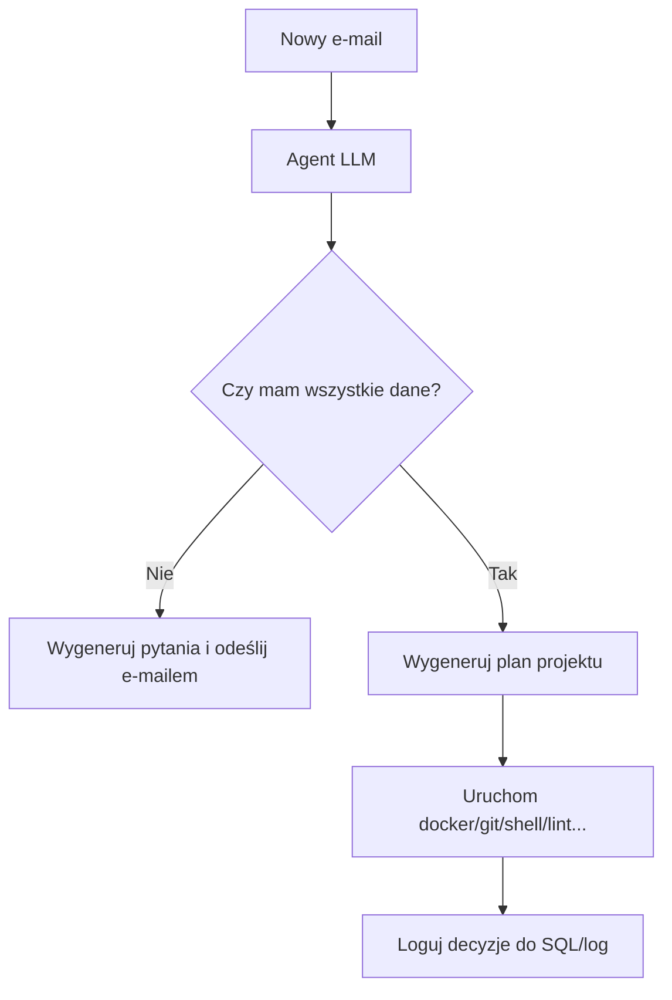

# mcps

Świetnie! Stworzymy kompletny **AI-powered DevOps System** oparty na **Model Context Protocol (MCP)**, który:

1. **rozpoczyna projekty na podstawie e-maila** (inicjacja człowieka),
2. **komunikuje się przez MCP z różnymi systemami** (shell, docker, git, fs, itd.),
3. **posiada agenta LLM**, który **zadaje pytania tylko, gdy brakuje informacji**,
4. **instaluje zależności, uruchamia kontenery, buildy, testy, itd.**,
5. jest **transparentny, modularny i sterowalny z jednego punktu**.

---

## 🧠 **Całościowa koncepcja systemu**

> „System autonomiczny, sterowany LLM, inicjowany przez człowieka przez e-mail, który automatycznie buduje projekt, testuje, wersjonuje i rozwija go dalej z pomocą MCP.”

---

## 📡 **Podsumowanie wymaganych MCP serwerów i klientów**

| Typ      | Nazwa Usługi (MCP)    | Funkcja                                                        |
| -------- | --------------------- | -------------------------------------------------------------- |
| ✅ Server | `mcp-server/email`    | Odbiór emaili z zamówieniami/projektami od ludzi               |
| ✅ Server | `mcp-server/git`      | Obsługa GIT (clone, push, pull, diff, commit)                  |
| ✅ Server | `mcp-server/fs`       | Przegląd plików, metadane, tree, zmiany                        |
| ✅ Server | `mcp-server/lint`     | Analiza jakości kodu (flake8, black, isort, bandit)            |
| ✅ Server | `mcp-server/test`     | Testy jednostkowe i integracyjne                               |
| ✅ Server | `mcp-server/sql`      | Baza wiedzy + zapis komunikacji i decyzji                      |
| ✅ Server | `mcp-server/log`      | Logowanie trace\_id, monitorowanie zadań                       |
| ✅ Server | `mcp-server/gitlab`   | Uruchamianie CI/CD z GitLab runners                            |
| ✅ Server | `mcp-server/browser`  | Przeglądanie internetu przez headless browser (np. Playwright) |
| ✅ Server | `mcp-server/docker`   | Tworzenie i uruchamianie kontenerów + image pulling            |
| ✅ Server | `mcp-server/shell`    | Wykonywanie zadań w shellu / środowisku OS                     |
| ✅ Server | `mcp-server/spec`     | Generowanie dokumentacji/spec z promptów                       |
| ✅ Server | `mcp-server/registry` | Dostęp do GitHub/GitLab/PyPI/DockerHub API dla pobierania info |

\| ✅ Client | `mcp-client/llm-agent`          | Główna jednostka sterująca, zadająca pytania, planująca wykonanie     |
\| ✅ Client | `mcp-client/planner`            | Strategiczny plan wykonania (dzielenie na kroki, kolejność, retry)    |
\| ✅ Client | `mcp-client/api-gateway`        | REST API, UI, CLI                                                     |
\| ✅ Client | `mcp-client/observer`           | Audytor wszystkiego (trace, decyzje, dane wejściowe/wyjściowe)        |

---

## 📦 **Łącznie: 13 MCP Serverów + 4 Klienty = 17 komponentów MCP**

---

## 📁 **Struktura całego projektu**

```
ai-devops-system/
├── docker-compose.yml
├── ansible/                         # provisioning lokalny i remote
│   ├── playbooks/
│   └── inventory/
├── terraform/                       # infrastruktura (opcjonalnie dla chmury)
│   └── main.tf
├── llm/
│   ├── dockerfile                   # DeepSeek/CodeLlama LLM container
│   └── weights/
├── mcp/
│   ├── clients/
│   │   ├── llm-agent/
│   │   ├── planner/
│   │   ├── api-gateway/
│   │   └── observer/
│   └── servers/
│       ├── email/
│       ├── fs/
│       ├── git/
│       ├── test/
│       ├── lint/
│       ├── sql/
│       ├── log/
│       ├── gitlab/
│       ├── shell/
│       ├── docker/
│       ├── browser/
│       ├── spec/
│       └── registry/
├── scripts/                         # helper tools, deployments
│   └── mcp_monitor.sh               # trace debugger
├── templates/                       # Prompty + wzory spec
├── projects/                        # aktywne projekty (mounted)
└── README.md
```

---

## 🐳 `docker-compose.yml` (fragment)

```yaml
version: "3.9"
services:

  llm:
    build: ./llm
    ports: ["8000:8000"]
    volumes: ["./llm/weights:/models"]

  mcp-client-llm-agent:
    build: ./mcp/clients/llm-agent
    depends_on: [llm]

  mcp-server-email:
    build: ./mcp/servers/email
    environment:
      - EMAIL_HOST=imap.domain.com
      - EMAIL_USER=...
      - EMAIL_PASS=...

  mcp-server-docker:
    build: ./mcp/servers/docker
    volumes:
      - /var/run/docker.sock:/var/run/docker.sock
      - ./projects:/workspace

  mcp-server-shell:
    build: ./mcp/servers/shell

  # itd... pozostałe serwery

  api-gateway:
    build: ./mcp/clients/api-gateway
    ports: ["5000:5000"]
```

---

## ⚙️ **Ansible**

* `ansible/playbooks/init-dev.yml` – konfiguruje maszynę dev:

  * instaluje Docker, Python, `git`, `llm-runner`
  * ustawia lokalne `cronjob` do odpytania `mcp-server/email`

---

## ☁️ **Terraform** (opcjonalnie – chmura lub serwery zdalne)

```hcl
resource "docker_container" "llm" {
  name  = "llm"
  image = "local-llm:latest"
  ports {
    internal = 8000
    external = 8000
  }
}
```

---

## ✉️ **Obsługa e-mail (MCP Email Server)**

* nasłuchuje na skrzynkę e-mail (IMAP)
* po wykryciu nowego maila:

  * parsuje temat, treść, załączniki
  * wysyła do `mcp-client/llm-agent` prompt: `Użytkownik prosi o projekt X, oto treść maila...`
* LLM zapyta: **jakie dane są potrzebne?**

  * jeśli ich nie ma → wysyła e-mail zwrotny z pytaniami
  * jeśli są → kontynuuje planowanie projektu

---

## 🤖 LLM Agent – flow logic



---

## 📌 **Finalna lista usług (z docker-compose)**

1. `llm`
2. `mcp-server/email`
3. `mcp-server/git`
4. `mcp-server/fs`
5. `mcp-server/lint`
6. `mcp-server/test`
7. `mcp-server/sql`
8. `mcp-server/log`
9. `mcp-server/gitlab`
10. `mcp-server/docker`
11. `mcp-server/shell`
12. `mcp-server/browser`
13. `mcp-server/spec`
14. `mcp-server/registry`
15. `mcp-client/llm-agent`
16. `mcp-client/planner`
17. `mcp-client/api-gateway`
18. `mcp-client/observer`

**🧱 18 usług**

---

Czy chcesz teraz:

* wygenerować **szkielet projektu w plikach**?
* stworzyć szablon **jednego z MCP Serverów** (np. `docker`, `email`)
* napisać **pierwszy scenariusz testowy** (np. email → kod)


# Struktura projektu: ai-devops-system
# =====================================
# Główne foldery i modularna organizacja projektu.

/
├── docker-compose.yml
├── requirements.txt
├── ansible/
│   └── ... (playbooki do instalacji docker, python, itd.)
├── terraform/
│   └── ... (opcjonalna infrastruktura pod chmurę)
├── llm/
│   ├── Dockerfile
│   └── app.py  # serwer LLM (FastAPI + weights)
├── projects/  # tu trzymane będą aktywne projekty
├── templates/ # szablony promptów, response, emaili itd.
├── scripts/   # helper tools, trace debug, deployy
└── mcp/
    ├── core/
    │   ├── decorators.py       # Model Context Protocol (MCP) Server

A Python implementation of the Model Context Protocol server with support for multiple services including Docker, Filesystem, and Email operations.

## Features

- **Docker MCP Server**: Manage Docker containers, images, volumes, and networks
- **Filesystem MCP Server**: Perform file and directory operations
- **Email MCP Server**: Send and manage emails with various providers
- **Webhook MCP Server**: Handle webhook events and callbacks
- **RESTful API**: Modern API design with OpenAPI documentation
- **Modular Architecture**: Easy to extend with new services
- **Environment Configuration**: Centralized configuration using environment variables
- **Logging & Monitoring**: Built-in logging and Prometheus metrics

## Prerequisites
import time
import logging

def trace(func):
    @wraps(func)
    async def wrapper(*args, **kwargs):
        start = time.time()
        logging.info(f"[TRACE] Calling: {func.__name__} with {args}, {kwargs}")
        result = await func(*args, **kwargs)
        duration = time.time() - start
        logging.info(f"[TRACE] Done: {func.__name__} in {duration:.2f}s")
        return result
    return wrapper

# Plik: mcp/servers/docker/main.py
from fastapi import FastAPI
from mcp.core.schema import MCPRequest, MCPResponse
from mcp.core.decorators import trace
import uuid

app = FastAPI()

@app.post("/mcp")
@trace
async def handle_mcp(req: MCPRequest) -> MCPResponse:
    if req.action == "list_images":
        from docker_api import list_images
        data = list_images()
    else:
        return MCPResponse(id=req.id, source="docker", status="error", data=f"Unknown action: {req.action}")

    return MCPResponse(id=req.id, source="docker", status="success", data=data)

# Plik: mcp/servers/docker/docker_api.py
import docker

def list_images():
    client = docker.from_env()
    return [img.tags for img in client.images.list()]
